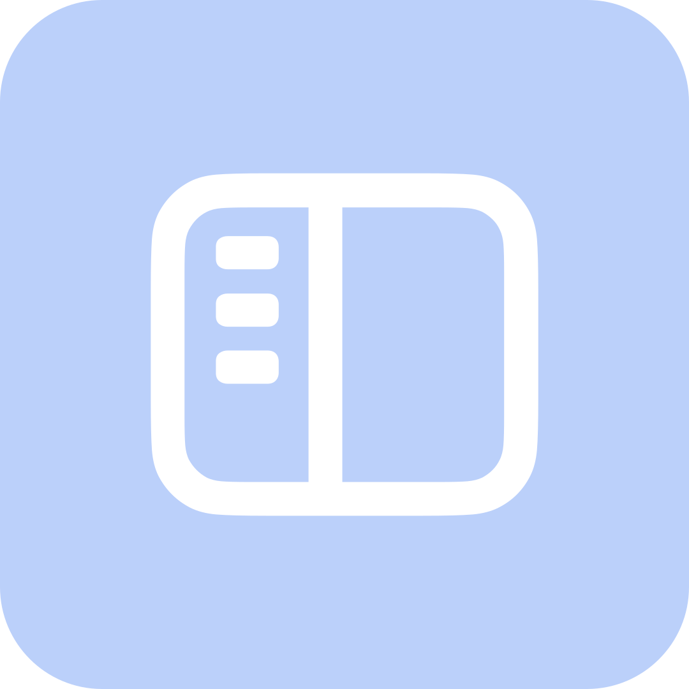

<div align="center">



# HyperDock

**为澎湃 OS3/4 打造的侧边栏（全局 Dock）增强模块**

[](https://github.com/1812z/HyperDock/releases)

[](LICENSE)
[](https://android.com)
[](https://github.com/LSPosed/LSPosed)
[](https://hyperos.mi.com)
[](https://developer.android.com/compose)

</div>

---

## ✨ 功能介绍

<table>
<tr>
<td width="50%">

### 🪟 自动展开面板
侧边栏滑出时直接展开全部应用面板，与侧边栏作为一个整体动画，无需二次点击。

</td>
<td width="50%">

### 🧩 栏目自定义
自由选择全部应用面板中显示的栏目并调整顺序，面板完全按你的习惯来。

</td>
</tr>
<tr>
<td width="50%">

### 🌊 错位展开
全部应用面板以独立动画展开，与侧边栏形成错位的层次感。

</td>
<td width="50%">

### ⚡ 面板预加载
保留已初始化的面板实例，加快侧边栏后续打开速度。

</td>
</tr>
<tr>
<td width="50%">

### 📱 全部应用自定义
白名单 / 黑名单两种模式，自由控制全部应用面板中显示的应用。

</td>
<td width="50%">

### 🧭 快捷方式
将系统开关、第三方磁贴、任意 Activity 添加到侧边栏，支持自定义排序与点击后自动收起侧边栏。

</td>
</tr>
<tr>
<td width="50%">

### 🏝️ HyperIsland 联动
一键触发 [HyperIsland](https://github.com/1812z/HyperIsland) 的录屏岛与实况录制。

</td>
<td width="50%">

### 🚀 快速启动
从侧边栏直接启动选定应用的任意 Activity，常用功能一步直达。

</td>
</tr>
</table>

---

## 📦 使用

1. 安装 APK 并在 LSPosed 中启用模块
2. 勾选作用域：**安全中心（com.miui.securitycenter）** 与 **系统界面（com.android.systemui）**
3. 重启系统界面与安全中心进程，滑出侧边栏即可体验

---

## 🔨 构建

确保已安装 JDK 21 和 Android SDK，然后运行：

```bash
./gradlew :app:assembleRelease
```

---

## Star History

<a href="https://star-history.dera.page/#1812z/HyperDock&type=date&legend=top-left">
 <picture>
   <source media="(prefers-color-scheme: dark)" srcset="https://star-history.dera.page/svg?repos=1812z/HyperDock&type=date&theme=dark&legend=top-left" />
   <source media="(prefers-color-scheme: light)" srcset="https://star-history.dera.page/svg?repos=1812z/HyperDock&type=date&legend=top-left" />
   
 </picture>
</a>

---

## 📄 许可证

本项目基于 [MIT License](LICENSE) 开源，欢迎 Issue 与 PR。

<div align="center">

Made with ❤️ for HyperOS users

[](https://github.com/1812z/HyperDock)

</div>
